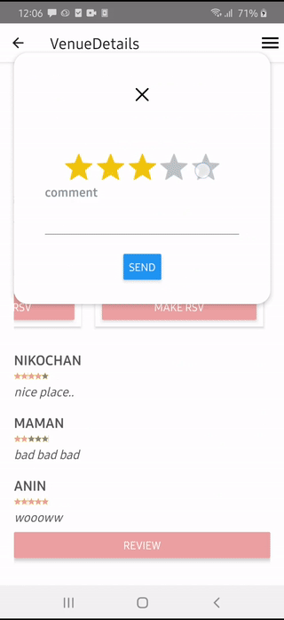

# venue-app

A full-stack venue booking app

## The idea 
My friend [avindah], (https://www.github.com/avin2520) noticed that there was no venue booking app in Indonesia. Some big companies, like Bridestory, implements a similar idea, but the rentee(user) have to manually ask the renter for availability and booking. So I decided to create this app.

Built within 10 workdays, this app is by no mean to be used for production use (think of it as a hackathon-style app), but this app demonstrate how to build an app from scratch, from front to back, from a business model to database design and code. 

## Features

### Authentication

- using JWT in the back-end
- auth credentials are stored in a redux store at the front-end
- passwords are hashed and not stored in plain text
- request that requires authentication is handled with `jwtAuth` middleware
- server-side validation using express validate
- OTP verification + resend using nodemailer

### Book and check availability by date

- Think of it as PT KAI seat booking
- successful midtrans payment or pending payment on that venue at particular date marked as booked

### Booking + midtrans transaction
- using [midtrans core](https://github.com/Midtrans/midtrans-nodejs-client) at the back end.
- every payment notification status change will be handled by `/api/midtrans/receive_notif`

-  multiple banking options

### Rating and comments
- rentee can leave a comment and rate the venue
- every comment will be accumulated and queried as avg rating of that particular venue at the front page
#### Demo

### More
- sort by city
- sort by price

### Limitation
- not always use coding best practice, some are spaghetti code that just need to 'work' and meeting time constraint
- some routes that should be protected and using authorization/authentication middleware don't
- not the best UI/UX design
- there must be a better DB design but I don't know yet
- this repo doesn't practice the good git commits
- and much more.., please consider PRs and issues if necessary

## Installation

### server
- `npm install`
- IMPORTANT!! for MySQL 8.x
please edit `node_modules > sequelize > lib > data-types.js` change the variable `GeomFromText` to `ST_GeomFromText`. This issue is related with sequelize

### usage
- change all .env variable with your keys
- to run the server `npm run dev:server`
- see example *.http files in the root folder for example usage
- using ORM, no need to manually create the table
- mock payment using [midtrans sandbox](https://simulator.sandbox.midtrans.com/bni/va/index), please create an account if you don't have one

### client
- `cd client2`
- `npm install`
- `npm run android`
- change `BASE_URL` in `utils` folder to your local address or remote server ip address/domain